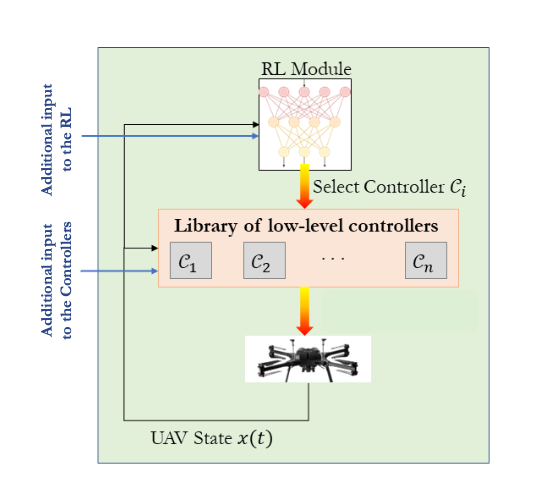
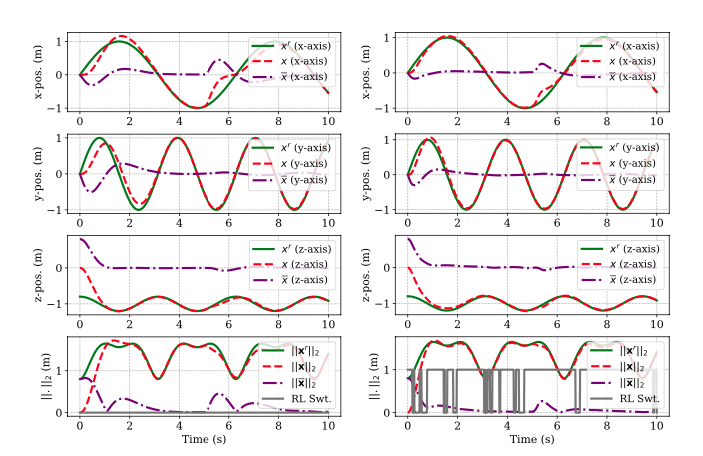
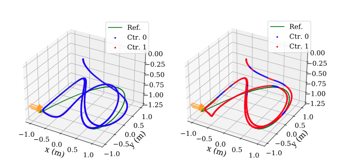
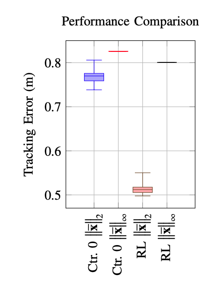

# Adaptive UAV Controller Switching via Reinforcement Learning

## 🚀 Introduction
This repository contains the implementation of our **Reinforcement Learning (RL) Framework for Adaptive UAV Controller Switching**. Our approach dynamically schedules UAV controllers to optimize trajectory tracking under **harsh environmental conditions**, such as **wind gusts, battlefield disturbances, and sudden environmental shifts**.

### 🔹 **Why Adaptive Controller Switching?**
Traditional UAV controllers are designed to handle a wide range of conditions **with a single controller**, often leading to **suboptimal performance** when environmental conditions change rapidly. Instead, we propose:
- **A library of controllers**, each optimized for different conditions.
- **A Reinforcement Learning (RL) agent** to dynamically switch controllers in real-time.
- **Enhanced trajectory tracking and disturbance rejection**, as validated through extensive simulations.

---

## 🎯 **Framework Overview**
Our RL-based controller switching architecture is illustrated below:

<p align="center">
  
</p>

**Figure 2: RL-based adaptive controller switching framework.**  
At any given time, the RL agent selects a controller from the library based on the UAV’s state and environmental conditions.

---

## 🔬 **Experimental Validation**
We evaluate the performance of our **RL switching controller** against a **single-controller approach (Controller 0)** under different conditions:

### **1️⃣ Nominal Conditions (No External Disturbances)**
- The RL switching controller significantly improves tracking accuracy.
- The UAV maintains better adherence to the reference trajectory.

<p align="center">
  
</p>

**Figure 8: Comparison of Controller 0 (Left) and RL Switching Controller (Right) under nominal conditions.**  
Tracking performance improves using adaptive switching.

---

### **2️⃣ Performance Under Disturbances**
- A **10N force is applied for 200ms** at a random time within **t ∈ [2, 9]s**.
- The RL switching controller **outperforms** Controller 0 across all disturbance scenarios.

<p align="center">
  
</p>

**Figure 9: Comparison of Controller 0 (Left) and RL Switching Controller (Right) under disturbances.**  
The RL controller demonstrates superior tracking accuracy.

---

### **3️⃣ Statistical Performance Comparison**
To validate generalization, we conduct **1000 experiments** comparing Controller 0 and the RL switching controller. The results show **significant reductions in tracking error ($L_2$ and $L_\infty$ norms)** under the RL policy.

<p align="center">
  
</p>

**Figure 10: Statistical performance comparison across 1000 experiments.**  
The RL switching controller achieves **lower tracking errors** in both $L_2$ and $L_\infty$ metrics.

---

## 📌 **Citing This Work**
If you use this repository, please cite our paper:

### **BibTeX Citation**
```bibtex
@inproceedings{albool2025adaptive,
  author = {Ibrahim Albool, Andrew Willis, Artur Wolek, and Dipankar Maity},
  title = {A Reinforcement Learning Framework to Adaptively Schedule Controllers for UAVs Operating under Harsh Environmental Conditions},
  booktitle = {ICUAS 2025},
  year = {2025},
  url = {https://github.com/ibrahim-albool/precision_wind_project}
}
```

### **Plain Text Citation**
I. Albool, A. Willis, A. Wolek, and D. Maity,  
"A Reinforcement Learning Framework to Adaptively Schedule Controllers for UAVs Operating under Harsh Environmental Conditions,"  
*International Conference on Unmanned Aircraft Systems (ICUAS)*, 2025.

---

## 🔧 **Installation & Setup**
### **1️⃣ Clone the Repository**
```bash
git clone https://github.com/ibrahim-albool/precision_wind_project.git
cd precision_wind_project
```
### **2️⃣ Install Dependencies**
```bash
pip install -r requirements.txt
```
### **3️⃣ Run Training**
```bash
python main.py ppo
```

### **3️⃣ Run Evaluation**
```bash
python main.py eval <PATH_TO_THE_POLICY>
ex.
python main.py eval LOG_DIRECTORY/from_slurm/6ee620-seed0_04-23-2024/actor.pt
```
